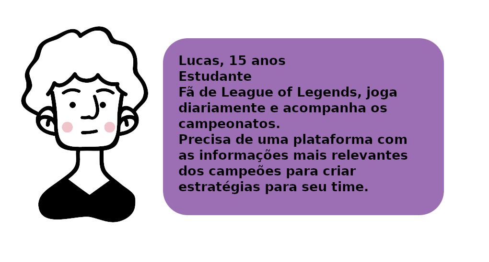
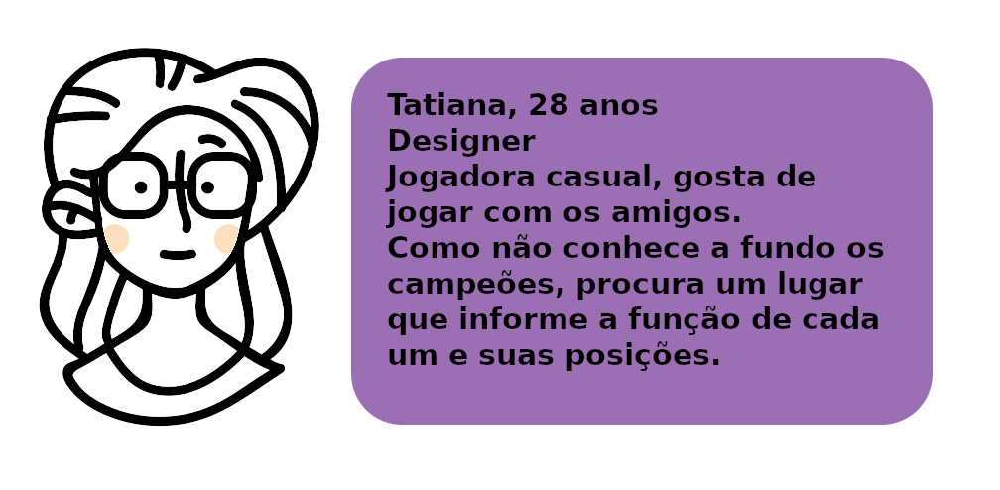
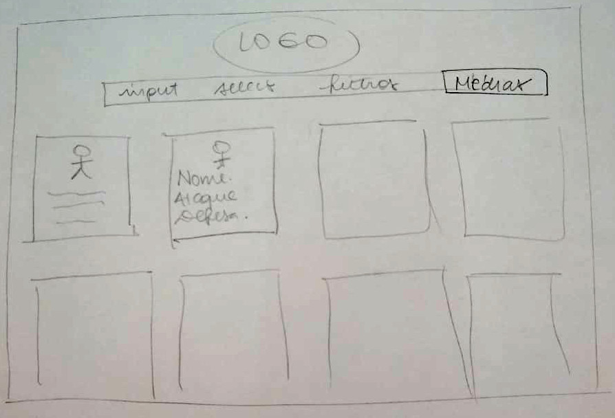
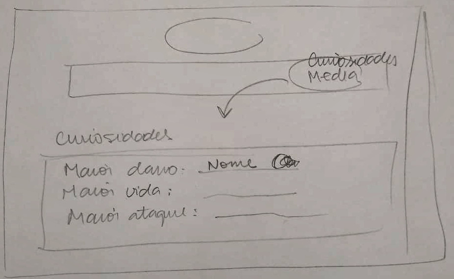
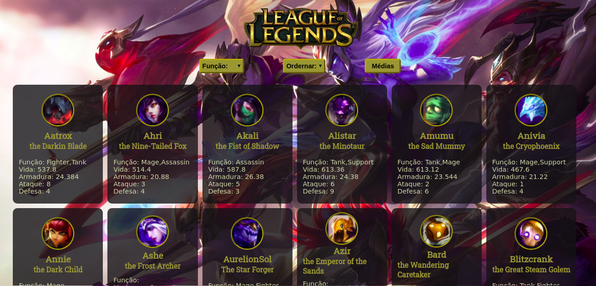
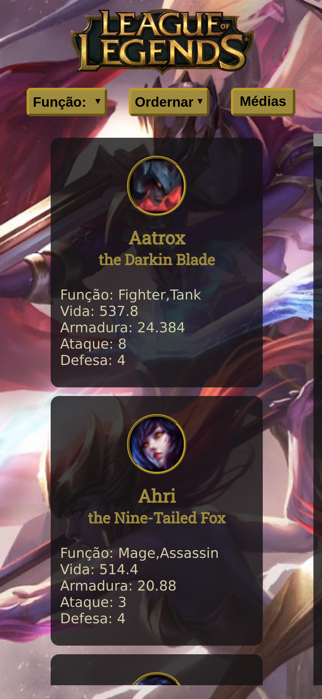

# Data Lovers - Dashboard

## 1. Resumo
Nesse projeto, temos como objetivo contruir uma página web responsiva que traga para o usuário informações de um banco de dados de acordo com suas necessidades. A partir de filtros, o usuário poderá selecionar apenas as informações necessárias.

O banco de dados escolhido é referente ao jogo **League of Legends**.

## 2. Usuários
Criamos duas protopersonas para dar partida às necessidades mais específicas do projeto e inserir um contexto a ele.

Elas são:

## 3. Funcionalidades - História do usuário
Após a definição dos usuários, pensamos em histórias a serem atendidas e suas funcionalidades necessárias.

"*Eu como usuário quero visualizar todos os champions, podendo organizar por ordem alfabética crescente ou decrescente*".

Funcionalidades:

- Cards para todos os *champions*;
- Poder ordenar por ordem alfabética;

"*Eu como usuário quero poder diferenciar os champions de acordo com sua função no jogo*"

Funcionalidades:

- Filtrar função/posição;
- Poder selecionar a função desejada;
- Visualizar apenas os *champions* de acordo com a escolha;

"*Eu como fã de League of Legends, gostaria de conhecer algumas curiosidades sobre os champions*"

Funcionalidades:

- Área que traz cálculos curiosos relacionados ao jogo;

## 4. Protótipo de baixa fidelidade
A partir das protopersonas e do banco de dados escolhido fizemos exercícios de brainstorm para cria o layout ideal.

Para criar um dashboard, precisamos de cards para mostrar as informações de maneira clara e campos para o usuário interagir com os dados (inputs - checkbox e select).

Esses foram os rascunhos finais que serão a base do layout da página:

Página inicial:

Página de curiosidades:

## 5. Layouts
Esses são os layouts finais das telas iniciais.

Versão web:

Versão mobile:

## 6. Ferramentas utilizadas

- Vanilla JS
- HTML 5
- CSS
- Git e GitHub
- Visual Code Studio
- Jest